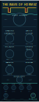
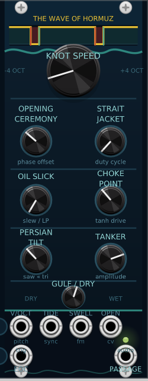

# The Wave of Hormuz

A VCV Rack 2 oscillator that encodes the 2023–2025 Strait of Hormuz conflict as a square wave. The base waveform is always **+1 (OPEN / free transit)** except during the programmed closure window, where it drops to **−1 (CLOSED / blockade)**. Every knob name is a pun on the Strait.

Default parameters reflect the real conflict timeline: **563 days** from Oct 7 2023 to Apr 22 2025, with a 22-day closure window at phase 0.336 (the MSC Aries seizure, Apr 13 – May 5 2024).

<p align="center">
  
  &nbsp;&nbsp;&nbsp;
  
</p>

---

## Prerequisites

| Tool | Notes |
|---|---|
| [VCV Rack 2](https://vcvrack.com) | Free or Pro |
| [VCV Rack 2 SDK](https://vcvrack.com/downloads) | Extract so that `<path>/plugin.mk` exists |
| [MSYS2](https://www.msys2.org) | Windows build environment |
| MinGW64 toolchain | Run in the MSYS2 shell: `pacman -S mingw-w64-x86_64-toolchain` |

> **Platform note:** The plugin currently builds on Windows only. The CRT heap bridge at the top of `src/WaveOfHormuz.cpp` is Windows-specific (see [Windows build notes](#windows-build-notes) below). macOS/Linux contributors can remove that block and build normally against the Rack SDK.

---

## Building

```bash
# Auto-detects the SDK if it is in a standard location.
# Override with RACK_DIR if needed.
RACK_DIR="$HOME/Documents/Rack-SDK" ./build.sh
```

| Command | Effect |
|---|---|
| `./build.sh` | Compile `plugin.dll` |
| `./build.sh install` | Compile and copy to the Rack 2 plugins folder |
| `./build.sh clean` | Remove all build artefacts |
| `./build.sh dist` | Build a distributable `.vcvplugin` zip |

`install` copies `plugin.dll`, `plugin.json`, and `res/` to:

```
%LOCALAPPDATA%\Rack2\plugins-win-x64\WaveOfHormuz\
```

Restart VCV Rack to pick up the updated plugin.

---

## Module reference

**10 HP.** One module: *The Wave of Hormuz*.

### Knobs

| Name | Range | Default | Pun | Function |
|---|---|---|---|---|
| **KNOT SPEED** | −4…+4 oct | 0 (C4) | nautical knots | Base pitch. Adds to V/OCT CV. |
| **OPENING CEREMONY** | 0…1 | 0.336 | strait opening | Phase fraction where the closure begins |
| **STRAIT JACKET** | 0…1 | 0.039 | straightjacket / strait | Closure duration as a fraction of one cycle |
| **OIL SLICK** | 0…1 | 0 | oil-tanker spill | One-pole LP smooths the hard square edges |
| **CHOKE POINT** | 0…1 | 0 | strategic chokepoint | Tanh soft-clip; drive goes from 1× to 10× (gain-compensated) |
| **PERSIAN TILT** | −1…+1 | 0 | Persian Gulf | Shape inside the closure: 0 = flat −1, +1 = triangle peak, −1 = rising ramp |
| **TANKER** | 0…1 | 1 | oil-tanker cargo | Output level (1.0 = ±5 V peak) |
| **GULF / DRY** | 0…1 | 1 | Gulf of Oman | Crossfade: 0 = plain 50% square, 1 = conflict-timeline wave |

### Inputs

| Jack | Signal | Function |
|---|---|---|
| **V/OCT** | ±5 V | 1 V/oct pitch CV, sums with KNOT SPEED |
| **TIDE** | Gate/Trig | Hard sync — rising edge resets phase to 0 |
| **SWELL** | ±5 V | FM — adds ¼× voltage to pitch (¼ V/oct per volt) |
| **OPEN** | ±5 V | CV for OPENING CEREMONY — adds 0.1× per volt |

### Outputs

| Jack | Signal | Function |
|---|---|---|
| **PASSAGE** | ±5 V audio | Main oscillator output |
| **EOC** | 0 / 10 V | 1 ms trigger pulse at the end of every cycle |

---

## Windows build notes

### Why there is a CRT heap bridge

`libRack.dll` (shipped with VCV Rack 2) is compiled against **MSVCRT** (`msvcrt.dll`), which uses its own private heap. Modern MSYS2 MinGW64 defaults to **UCRT** (`ucrtbase.dll`), a separate private heap.

At runtime Rack calls `delete` on widgets our plugin allocates with `new`. Because `new` used UCRT's `malloc` but `delete` reaches MSVCRT's `free`, the two heap handles don't match and `RtlFreeHeap` crashes with signal 11.

The fix at the top of `src/WaveOfHormuz.cpp` overrides global `operator new` / `operator delete` to load `msvcrt.dll` at startup via `LoadLibrary` and call its `malloc`/`free` directly. All plugin allocations then live on the MSVCRT heap that Rack expects.

### Why labels are drawn in C++ rather than SVG

NanoSVG (the Rack SVG renderer) silently discards all `<text>` elements. The `res/WaveOfHormuz.svg` file contains `<text>` nodes for layout reference only. All visible text is rendered programmatically via the `PanelText` widget in `src/WaveOfHormuz.cpp`.

`ui::Label` (the Rack SDK label widget) was tried first but also crashes: its constructor is in `libRack.dll` and initialises a `std::string text` member using MSVCRT's allocator; assigning to that field from plugin code calls our copy of `std::string::operator=` (statically linked, UCRT-based), which tries to free the old buffer through the wrong heap. `PanelText` avoids this entirely by holding only a `const char*` pointer to a string literal.

---

## File layout

```
WaveOfHormuz/
├── plugin.json          manifest (slug, version, module list)
├── Makefile             standard VCV Rack 2 Makefile
├── build.sh             build helper (build / install / clean / dist)
├── src/
│   ├── plugin.hpp       shared header (Plugin*, Model* declarations)
│   ├── plugin.cpp       init() — registers the module
│   └── WaveOfHormuz.cpp all DSP, widget, and label code
└── res/
    └── WaveOfHormuz.svg panel artwork (10 HP, dark-navy / teal / gold)
```

---

## License

GPL-3.0-or-later
