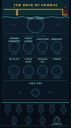

# The Wave of Hormuz

A VCV Rack 2 oscillator that encodes the 2023–2026 Strait of Hormuz conflict as a dual-closure square wave. The waveform is always **+1 (OPEN / free transit)** except during the two programmed closure windows, where it drops to **−1 (CLOSED / blockade)**. Every knob name is a pun on the Strait.

Default parameters reproduce the real conflict timeline at **data-accurate proportions** — **947 days** from Oct 7 2023 to May 11 2026 — with all knob defaults set so the unmodified module plays the historical square wave exactly:

| Phase | Days | Event |
|---|---|---|
| 0.000 – 0.200 | 189 | OPEN |
| 0.200 – 0.223 | 22 | **CLOSED** — Iran seizes MV MSC Aries (Apr 13 – May 5 2024) |
| 0.223 – 0.926 | 666 | OPEN |
| 0.926 – 1.000 | 70 | **CLOSED** — Renewed blockade (Mar 2 2026 – present) |

The panel waveform graphic shows these proportions accurately: the first closure appears as a hairline notch (~1.5 mm at panel scale); the second as a solid block at the right edge.

<p align="center">
  
  &nbsp;&nbsp;&nbsp;
  
</p>

---

## Prerequisites

| Tool | Notes |
|---|---|
| [VCV Rack 2](https://vcvrack.com) | Free or Pro |
| [VCV Rack 2 SDK](https://vcvrack.com/downloads) | Extract so that `<path>/plugin.mk` exists |
| [MSYS2](https://www.msys2.org) | Windows build environment |
| MinGW64 toolchain | Run in the MSYS2 shell: `pacman -S mingw-w64-x86_64-toolchain` |

> **Platform note:** The plugin currently builds on Windows only. The CRT heap bridge at the top of `src/WaveOfHormuz.cpp` is Windows-specific (see [Windows build notes](#windows-build-notes) below). macOS/Linux contributors can remove that block and build normally against the Rack SDK.

---

## Building

```bash
# Auto-detects the SDK if it is in a standard location.
# Override with RACK_DIR if needed.
RACK_DIR="$HOME/Documents/Rack-SDK" ./build.sh
```

| Command | Effect |
|---|---|
| `./build.sh` | Compile `plugin.dll` |
| `./build.sh install` | Compile and copy to the Rack 2 plugins folder |
| `./build.sh clean` | Remove all build artefacts |
| `./build.sh dist` | Build a distributable `.vcvplugin` zip |

`install` copies `plugin.dll`, `plugin.json`, and `res/` to:

```
%LOCALAPPDATA%\Rack2\plugins-win-x64\WaveOfHormuz\
```

Restart VCV Rack to pick up the updated plugin.

> **Before running `install`:** close VCV Rack completely. Rack holds `plugin.dll` open while running; the copy will fail with a "device busy" error otherwise. `build.sh` will detect this and print a clear message.

---

## Troubleshooting

| Symptom | Cause | Fix |
|---|---|---|
| `install` fails: *device or resource busy* | VCV Rack is running and has `plugin.dll` locked | Close Rack, then re-run `./build.sh install` |
| `jq` warnings during build (`pipe: No error`) | `jq` is not installed; `plugin.mk` tries to read SLUG/VERSION from it | Safe to ignore — `build.sh` passes both values directly via `MAKE_FLAGS`; install `jq` with `choco install jq` to silence it |
| Silent `Error 1` compile failure, no diagnostic shown | `make` found Git's `sh.exe` as its shell; that shell's PATH excludes MSYS2, so `g++` can't find its own standard-library headers | `build.sh` now passes `SHELL=/c/msys64/usr/bin/bash` to `make` automatically when MSYS2 is present — always build via `./build.sh` rather than bare `make` |
| Compiler errors don't appear in terminal output | On Windows, `make`'s stderr from `g++` can be swallowed by the Git shell | Run the failing `g++` command directly in **PowerShell** (`& g++ ... 2>&1`) to see full diagnostics |
| Module crashes Rack on load | Wrong CRT in the build toolchain (UCRT vs MSVCRT) | Use the MSYS2 **MINGW64** shell, not UCRT64 or Chocolatey MinGW. `build.sh` prefers `/c/msys64/mingw64/bin` |
| Closure windows overlap | C1 always takes priority over C2 in the DSP when the windows share a phase region | Intended — dial the windows apart; OPENING CEREMONY + STRAIT JACKET must not overlap SANCTIONS |

---

## Module reference

**14 HP.** One module: *The Wave of Hormuz*.

### Knobs

| Name | Range | Default | Pun | Function |
|---|---|---|---|---|
| **KNOT SPEED** | −4…+4 oct | 0 (C4) | nautical knots | Base pitch; adds to V/OCT and SWELL CVs |
| **OPENING CEREMONY** | 0…1 | 189/947 ≈ 0.200 | strait opening | Phase start of closure 1 (C1) |
| **STRAIT JACKET** | 0…1 | 22/947 ≈ 0.023 | straightjacket / strait | Width of closure 1 (C1) |
| **SANCTIONS** | 0…1 | 877/947 ≈ 0.926 | international sanctions | Phase start of closure 2 (C2) |
| **EMBARGO** | 0…1 | 70/947 ≈ 0.074 | embargo duration | Width of closure 2 (C2) |
| **OIL SLICK** | 0…1 | 0 | oil-tanker spill | One-pole LP smooths hard square edges |
| **CHOKE POINT** | 0…1 | 0 | strategic chokepoint | Tanh soft-clip; drive 1× → 10× (gain-compensated) |
| **PERSIAN TILT** | −1…+1 | 0 | Persian Gulf | Shape inside closures: 0 = flat −1, +1 = triangle peak, −1 = rising ramp |
| **TANKER** | 0…1 | 1 | oil-tanker cargo | Output level (1.0 = ±5 V peak) |
| **GULF / DRY** | 0…1 | 1 | Gulf of Oman | Crossfade: 0 = plain 50% square, 1 = dual-closure wave |

### Inputs

| Jack | Signal | Function |
|---|---|---|
| **V/OCT** | ±5 V | 1 V/oct pitch CV, sums with KNOT SPEED |
| **TIDE** | Gate/Trig | Hard sync — rising edge resets phase to 0 |
| **SWELL** | ±5 V | FM — adds ¼ V/oct per volt to pitch |
| **OPEN** | ±5 V | CV for OPENING CEREMONY (C1 start) — adds 0.1/V |
| **LOCK** | ±5 V | CV for SANCTIONS (C2 start) — adds 0.1/V |
| **TILT** | ±5 V | CV for PERSIAN TILT — adds 0.2/V, clamped ±1; applies to **both** C1 and C2 |

### Outputs

| Jack | Signal | Function |
|---|---|---|
| **EOC** | 0 / 10 V | 1 ms trigger at the end of every cycle |
| **C1** | 0 / 10 V | Gate — high while inside closure 1 (yellow LED) |
| **C2** | 0 / 10 V | Gate — high while inside closure 2 (red LED) |
| **PASSAGE** | ±5 V audio | Main oscillator output (green LED = level) |

---

## Windows build notes

### Why there is a CRT heap bridge

`libRack.dll` (shipped with VCV Rack 2) is compiled against **MSVCRT** (`msvcrt.dll`), which uses its own private heap. Modern MSYS2 MinGW64 defaults to **UCRT** (`ucrtbase.dll`), a separate private heap.

At runtime Rack calls `delete` on widgets our plugin allocates with `new`. Because `new` used UCRT's `malloc` but `delete` reaches MSVCRT's `free`, the two heap handles don't match and `RtlFreeHeap` crashes with signal 11.

The fix at the top of `src/WaveOfHormuz.cpp` overrides global `operator new` / `operator delete` to load `msvcrt.dll` at startup via `LoadLibrary` and call its `malloc`/`free` directly. All plugin allocations then live on the MSVCRT heap that Rack expects.

### Why labels are drawn in C++ rather than SVG

NanoSVG (the Rack SVG renderer) silently discards all `<text>` elements. The `res/WaveOfHormuz.svg` file contains `<text>` nodes for layout reference only. All visible text is rendered programmatically via the `PanelText` widget in `src/WaveOfHormuz.cpp`.

`ui::Label` was tried first but also crashes: its constructor (in `libRack.dll`) initialises a `std::string text` member using MSVCRT's allocator; assigning to that field from plugin code calls the UCRT-based copy of `std::string::operator=`, which tries to free the old buffer through the wrong heap. `PanelText` avoids this entirely by holding only a `const char*` to a string literal.

---

## File layout

```
WaveOfHormuz/
├── plugin.json          manifest (slug, version, module list)
├── Makefile             standard VCV Rack 2 Makefile
├── build.sh             build helper (build / install / clean / dist)
├── src/
│   ├── plugin.hpp       shared header (Plugin*, Model* declarations)
│   ├── plugin.cpp       init() — registers the module
│   └── WaveOfHormuz.cpp all DSP, widget, and label code
└── res/
    └── WaveOfHormuz.svg panel artwork (14 HP, dark-navy / teal / gold)
```

---

## License

GPL-3.0-or-later
